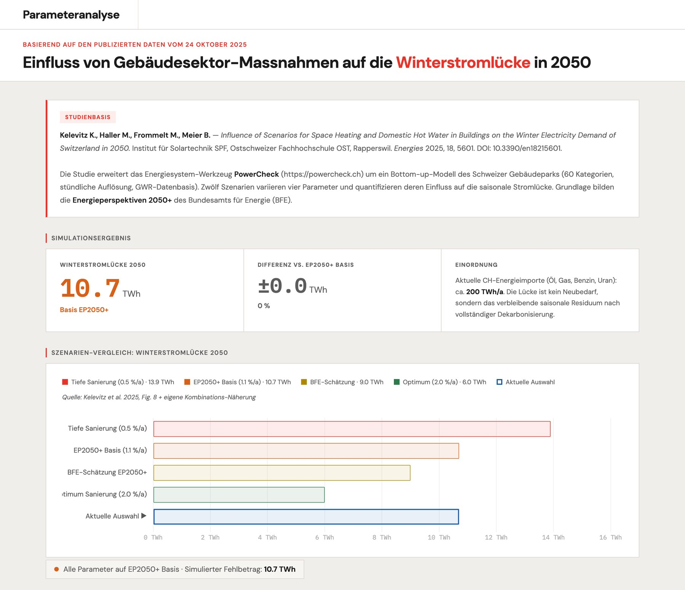

# Raffael

[Deutsch](https://github.com/Raffa3l/Raffa3l/blob/main/README.md) · **English**

**Building Physics · Energy Systems · Climate Data · Interactive Tools**

I am an engineer based in Switzerland, developing tools, models and visualisations for buildings, indoor climate and energy systems. I combine physical models with data and software to make technical relationships easier to understand and explore.

On GitHub, I publish practical applications and experiments: from thermal comfort evaluation and weather-based ventilation guidance to the analysis of Swiss winter electricity demand.

[Projects](#selected-projects) · [Fields](#fields) · [Approach](#approach) · [Contact](#contact)

## Selected Projects

### SIA 180 · Thermal Comfort

**Assessing room temperatures in relation to outdoor conditions.**

Interactive visualisation of indoor thermal comfort according to **SIA 180:2014**. The application relates measured room temperatures to the 48-hour rolling mean outdoor temperature and displays the comfort limits for actively and passively cooled buildings.

It helps interpret measurement data and present indoor comfort conditions clearly.

**Topics:** Building physics, thermal comfort, indoor climate, standards  
**Technology:** Python, Pandas, NumPy, Plotly

[Repository](https://github.com/Raffa3l/SIA-180-thermal-comfort) · [Open App](https://git.logicc.ch/SIA-180-thermal-comfort/)

### Lüftungsassistent · Ventilation Assistant

Example captured on 11 September 2026. Weather data and recommendations change over time.

**Making effective use of summer ventilation and passive cooling.**

The ventilation assistant combines weather forecasts with a simplified thermal room model. It estimates how indoor temperatures will develop and helps determine when opening windows is beneficial.

The model considers thermal mass, room use, occupancy, window orientation, solar gains and solar protection, among other factors. Weather data on temperature, humidity and wind inform the assessment of ventilation and night cooling.

Designed for homes, classrooms and offices.

**Topics:** Summer thermal comfort, passive cooling, building physics, weather data  
**Technology:** TypeScript, Vite, SVG, Open-Meteo

[Repository](https://github.com/Raffa3l/Lueftungsassistent) · [Open App](https://git.logicc.ch/Lueftungsassistent/)

### Winterstromlücke Schweiz 2050 · Swiss Winter Electricity Gap

**Exploring how the building sector influences seasonal electricity supply.**

Interactive parameter analysis based on the [study by Kelevitz et al. (2025)](https://doi.org/10.3390/en18215601). The application illustrates how four factors affect the projected Swiss winter electricity gap in 2050:

- Building envelope renovation rate
- Domestic hot-water heat recovery
- Share of ground-source heat pumps
- Assumed climate warming

The calculation combines the published individual scenarios using an additive approximation. It makes the relationships between building renovation, heat supply and electricity demand accessible through interactive exploration.

**Topics:** Energy systems, heat pumps, building stock, winter electricity demand  
**Technology:** JavaScript, Chart.js

[Repository](https://github.com/Raffa3l/Winterstromluecke-2050) · [Open App](https://git.logicc.ch/Winterstromluecke-2050/)

## Fields

| Field | Focus |
| :--- | :--- |
| **Building Physics** | Thermal comfort, summer heat protection, moisture and indoor climate |
| **Climate and Weather Data** | Analysing meteorological datasets and making them useful for building-related questions |
| **Energy Systems** | Heat pumps, electrification, photovoltaics and seasonal electricity demand |
| **Building Technology** | Ventilation, heating, cooling and operational optimisation |

I am particularly interested in the interactions between these fields: How does a changing climate affect building requirements? What can solar protection and night cooling achieve? And how do decisions across the building stock affect the energy system?

## Other Tools and Experiments

### todo.txt App

A task manager based on the open **todo.txt** plain-text format. The application runs entirely in the browser, without a backend or database. Tasks can be imported and exported as text files.

**Technology:** JavaScript, HTML, CSS

[Repository](https://github.com/Raffa3l/todo.txt-App) · [Open App](https://git.logicc.ch/todo.txt-App/)

Other experiments such as [Memex](https://github.com/Raffa3l/Memex) explore personal knowledge and information management.

[Browse All Public Repositories](https://github.com/Raffa3l?tab=repositories)

## Approach

- **Make the physics understandable.** Models, assumptions and units should remain transparent.
- **Show the relationships.** Interactive tools should explain how inputs influence results.
- **Limit complexity.** I look for the simplest model that suits the question.
- **Keep data inspectable.** Sources, assumptions and processing steps should be documented wherever possible.
- **Take usability seriously.** A technical tool needs to be understandable and useful in everyday work.
- **Choose infrastructure deliberately.** A static application without a server or user account is sufficient for many of my projects.

## Technology

The engineering question guides my choice of tools.

| Area | Tools |
| :--- | :--- |
| Languages | Python, TypeScript, JavaScript, HTML, CSS |
| Data and Visualisation | Pandas, NumPy, Plotly, Chart.js, SVG |
| Development and Publishing | Git, Vite, GitHub Actions, GitHub Pages |

My repositories include both research prototypes and applications for practical questions. Documentation is written in German or English, depending on the project.

## Contact

**Research & Projects** [logicc.ch](https://logicc.ch)

**GitHub** [github.com/Raffa3l](https://github.com/Raffa3l)

**Email:** hello [at] logicc [dot] ch

Licensing terms are defined in each repository.
