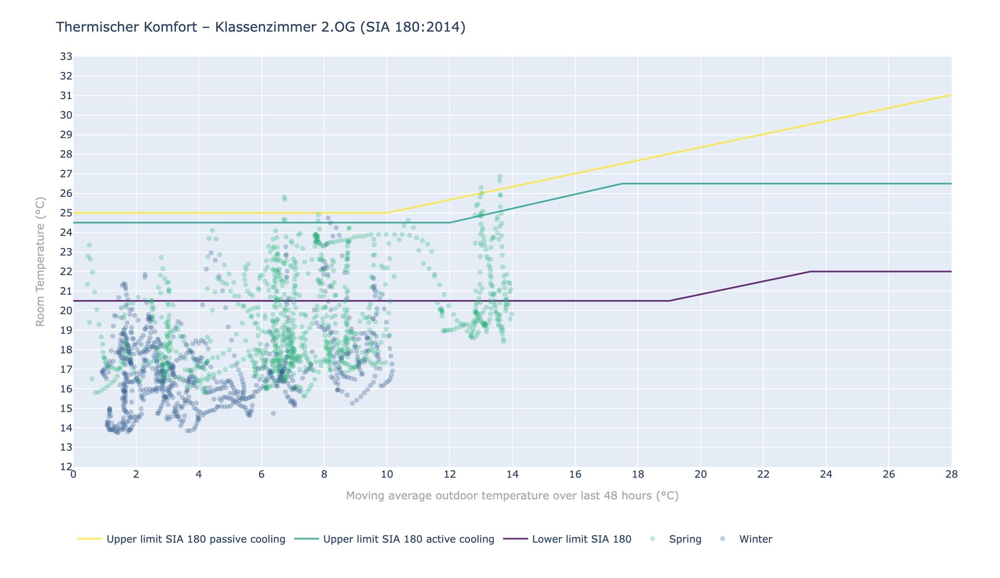
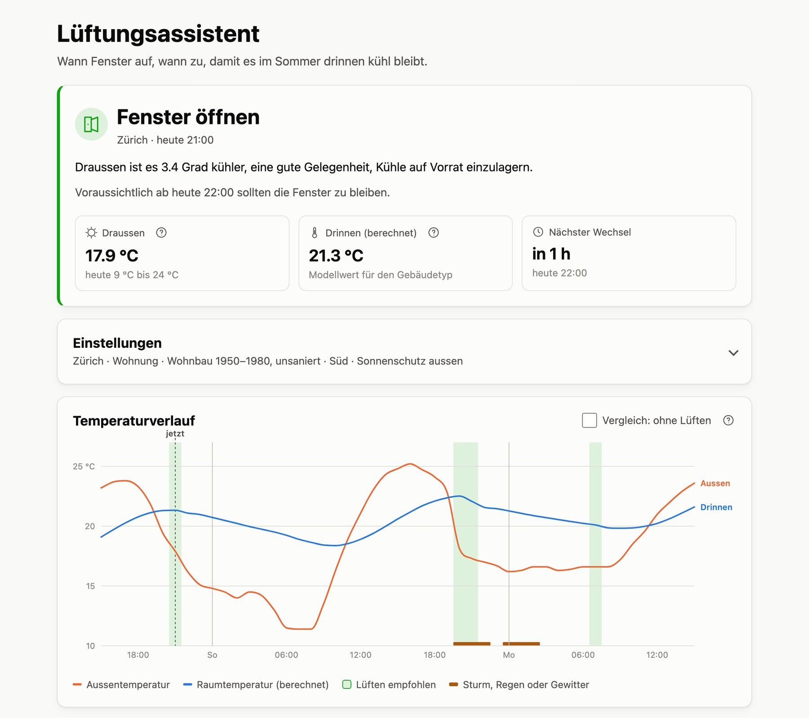
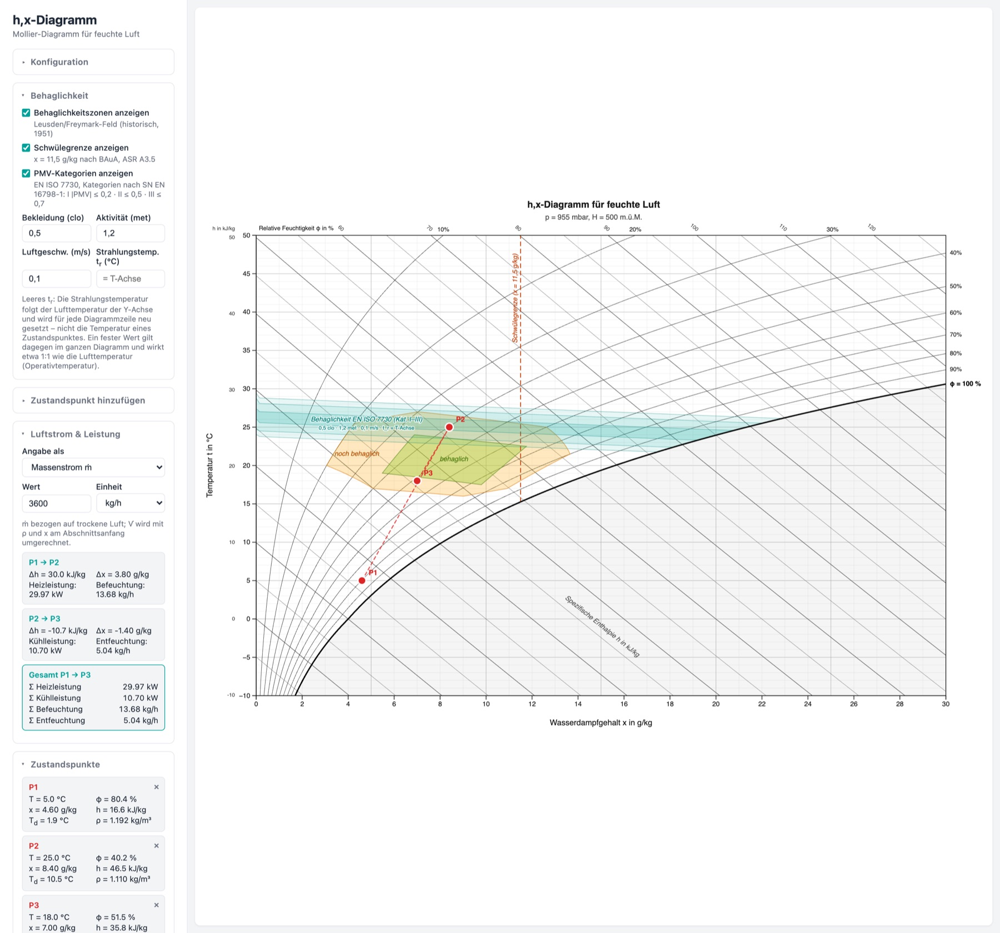

  
  
  

  <b>Deutsch</b> · <a href="https://github.com/Raffa3l/Raffa3l/blob/main/README.en.md">English</a>

**Werkzeuge aus der Praxis.**

Raffael ist Ingenieur aus der Schweiz und arbeitet an der Schnittstelle von Architektur, Gebäudetechnik und Daten – dort, wo Normen auf Messwerte treffen und eine Tabelle nicht mehr reicht. Er entwickelt offene, interaktive Werkzeuge, die physikalische Modelle mit Daten und Software verbinden. Unter [logicc.dev](https://logicc.dev) bündelt er seine Arbeit auf Ausführungs- und Forschungsebene.

Alle Werkzeuge direkt ausprobieren unter
  <a href="https://logicc.dev/">logicc.dev</a> oder die <a href="https://github.com/Raffa3l?tab=repositories">Repositories</a> ansehen.

## Ausgewählte Arbeiten

| Projekt | Fokus | Wozu es nützt |
| --- | --- | --- |
| [SIA 180 · Thermische Behaglichkeit](https://github.com/Raffa3l/SIA-180-thermal-comfort) | Gebäudephysik, Normen | Gemessene Raumtemperaturen nach SIA 180:2014 einordnen und Komfortgrenzen sichtbar machen. |
| [Lüftungsassistent](https://github.com/Raffa3l/Lueftungsassistent) | Sommerlicher Wärmeschutz | Stündlich entscheiden, ob Fenster offen oder geschlossen sein sollten – auf Basis von Wetterprognose und Raummodell. |
| [Winterstromlücke 2050](https://github.com/Raffa3l/Winterstromluecke-2050) | Energiesysteme | Erkunden, wie Sanierung, Wärmepumpen und Klima die Schweizer Winterstromlücke verändern. |
| [h,x-Diagramm](https://github.com/Raffa3l/hx-Diagramm) | Gebäudetechnik, Luftbehandlung | Zustandsänderungen feuchter Luft im Mollier-Diagramm konstruieren und Heiz-, Kühl- und Befeuchtungsleistungen direkt ablesen. |
| [todo.txt App](https://github.com/Raffa3l/todo.txt-App) | Werkzeug | Aufgaben im offenen Klartextformat verwalten – vollständig im Browser, ohne Backend. |
| [Memex](https://github.com/Raffa3l/Memex) | Wissensmanagement | Ein persönliches Wissenssystem, das ein LLM aus PDFs als Wiki aufbaut und pflegt. |

### SIA 180 · Thermische Behaglichkeit

**Raumtemperaturen im Zusammenhang mit dem Aussenklima beurteilen.** Die Anwendung setzt gemessene Raumtemperaturen in Beziehung zum gleitenden 48-Stunden-Mittel der Aussentemperatur und zeigt die Behaglichkeitsgrenzen für aktiv und passiv gekühlte Gebäude nach **SIA 180:2014**.

  
  
  
  

[Anwendung öffnen →](https://logicc.dev/SIA-180-thermal-comfort/) · [Repository](https://github.com/Raffa3l/SIA-180-thermal-comfort)

### Lüftungsassistent

Beispielansicht vom 12.09.2026. Wetterdaten und Empfehlungen ändern sich laufend.

**Sommerlüftung und passive Kühlung gezielt nutzen.** Der Lüftungsassistent verbindet Wetterprognosen mit einem vereinfachten thermischen Raummodell und berücksichtigt Speichermasse, Nutzung, Belegung, Fensterorientierung, solare Gewinne und Sonnenschutz. Gedacht für Wohnungen, Schulzimmer und Büros.

  
  
  
  

[Anwendung öffnen →](https://logicc.dev/Lueftungsassistent/) · [Repository](https://github.com/Raffa3l/Lueftungsassistent)

### h,x-Diagramm · Mollier-Diagramm für feuchte Luft

**Luftbehandlung im Diagramm nachvollziehen.** Zustandspunkte lassen sich per Klick setzen, verschieben oder numerisch eingeben. Die Anwendung berechnet Temperatur, relative und absolute Feuchte, Enthalpie, Taupunkt und Dichte sowie die Leistungen für Heizen, Kühlen, Be- und Entfeuchten. Zuschaltbar sind Behaglichkeitsfelder nach Leusden/Freymark, die Schwülegrenze (x = 11,5 g/kg) und PMV-Kategorien nach **EN ISO 7730**. Luftdruck und Standorthöhe sind einstellbar.

  
  
  
  

[Anwendung öffnen →](https://logicc.dev/hx-Diagramm/) · [Repository](https://github.com/Raffa3l/hx-Diagramm)

## Fachgebiete

| Fachgebiet | Schwerpunkte |
| --- | --- |
| **Gebäudephysik** | Thermische Behaglichkeit, sommerlicher Wärmeschutz, solare Gewinne, Gebäudehülle, Feuchtigkeit und Raumklima |
| **Klima- und Wetterdaten** | Meteorologische Datensätze auswerten und für Gebäudefragen nutzbar machen |
| **Energiesysteme** | Wärmepumpen und Kälteversorgung, Elektrifizierung, Photovoltaik, saisonale Speicherung und Winterstrombedarf |
| **Gebäudetechnik** | Lüftung, Heizung, aktive und passive Kühlung, Nachtkühlung, Warmwasser, Wärmerückgewinnung, Messdaten und Betriebsoptimierung |

Im Fokus stehen die Wechselwirkungen: Wie verändert das Klima die Anforderungen an Gebäude? Wie verändern Entscheidungen im Gebäudepark das Energiesystem?

## Arbeitsweise

| Prinzip | Was das heisst |
| --- | --- |
| **Physik verständlich machen** | Modelle, Annahmen und Einheiten bleiben nachvollziehbar. |
| **Komplexität begrenzen** | Das einfachste Modell, das zur Fragestellung passt. |
| **Daten prüfbar halten** | Quellen, Annahmen und Verarbeitungsschritte sind dokumentiert. |
| **Infrastruktur bewusst wählen** | So viel Infrastruktur wie nötig, so einfach und effizient wie möglich. |
| **In der Praxis prüfen** | Ein Modell bewährt sich erst an Messwerten und im Betrieb. Was sich nicht bewährt, fliegt raus. |
| **Offen teilen** | Quelltext, Annahmen und Ergebnisse so veröffentlichen, dass andere darauf aufbauen können. |

## Werkzeugkasten

| Ebene | Werkzeuge |
| --- | --- |
| **Sprachen** | Python · TypeScript · JavaScript · HTML · CSS |
| **Daten & Visualisierung** | Pandas · NumPy · MATLAB · KNIME · Plotly · Chart.js · D3.js · SVG |
| **Entwicklung & Veröffentlichung** | Git · Vite · GitHub Actions · GitHub Pages |

Die Repositories enthalten Forschungsprototypen ebenso wie Anwendungen für praktische Fragestellungen. Die Dokumentation ist je nach Projekt auf Deutsch oder Englisch verfasst.

## Kontakt

- **Labor:** [logicc.dev](https://logicc.dev/)
- **Code:** [@Raffa3l auf GitHub](https://github.com/Raffa3l)
- **E-Mail:** hello [at] logicc [dot] dev

## Lizenz

Die Projekte stehen unter der MIT-Lizenz. Massgebend sind die Bedingungen im jeweiligen Repository.
